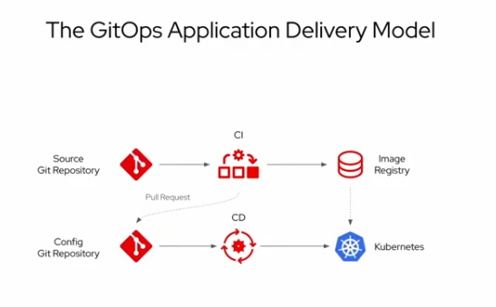
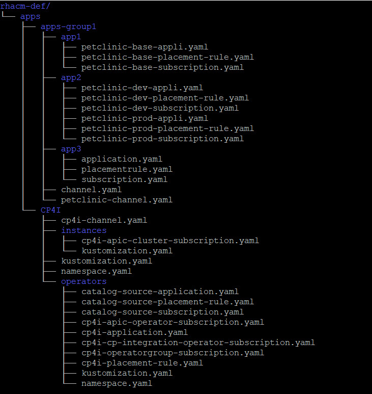
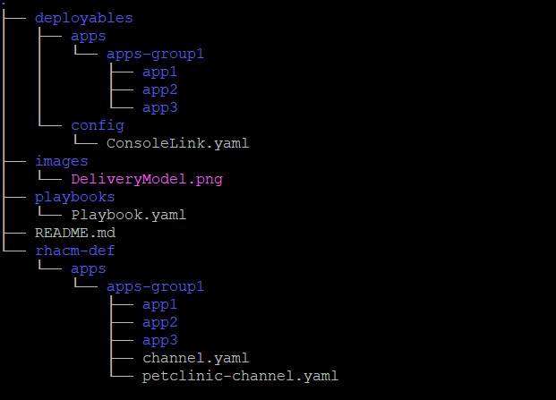
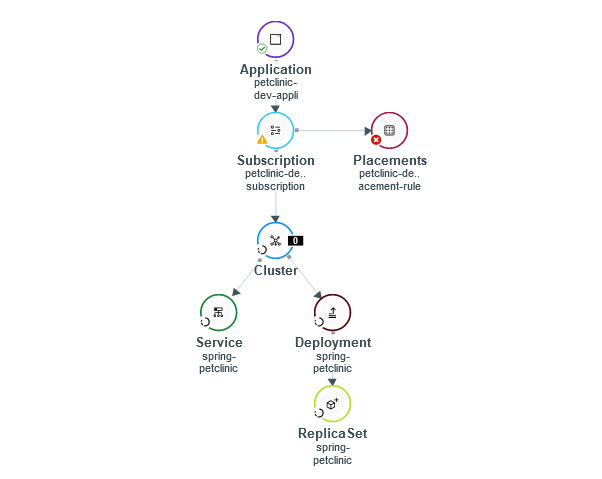
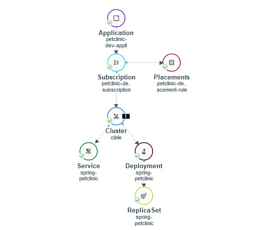

GitOps exploration
=====================
GitOps is a declarative approach to **continuous delivery** that uses Git as the single source of truth for everything (infrastructure and application)



Concepts
========
RHACM can be used to automate the deployment of applications in target environments (kubernetes clusters) and keep them synchronized 

The main concepts are (CRD):

- **Cluster Hub** : the central cluster that manage all the deployments
- **managed cluster** : the clusters where the applications are deployed to

 
- **applications** : that define the groups of subscriptions that participate to each application to deploy
- **channels** : that define the git repositories
- **subscriptions** : that define the subset of manifests in a channel that defines the kubernetes objects to deploy
- **placementrules** : that define the target cluster selection rules


Architecture
============
repository architecture:
------------------------
  - rhacm-def folder contains the descriptions of the various RHACM Custom resources



  - deployables folder contains everything needed to deploy applications



Cluster Hub namespaces
----------------------
- opencluster-management: created by default for RHACM
- one namespace for each application definitions

Pre-req to play with this workshop
==================================
You need two OCP clusters:
- The first one will be the hub cluster and host RHACM,
- the other one will be the managed cluster and host the applications

For UC4, you need an Ansible Tower instance

To be able to use openshift cli (oc) you need a bastion with connexion to each of the clusters

To install the hub cluster, execute the following steps on the Hub Cluster:
- install RHACM: RHACM is available as an operator in the OperatorHub ;  Complete the installation by creating a multiclusterhub instance
- find the route to RHACM using the OCP console Networking>>routes from open-cluster-management project
- open the RHACM console by clicking on the route
- generate the command to import the managed cluster into the Hub Cluster: use the button under Infrastructure>>Clusters
- copy the generated command
- run this command on the bastion after logging to the managed cluster

Simple use cases
=====================

UC1: Add a link to the OCP Console (Config)
-------------------------------------------
TBD

UC2: Deploy a simple application (petclinic)
--------------------------------------------
- look at gitops-with-rhacm/rhacm-def/apps/apps-group1/petclinic folder\
This folder contains the RHACM Custom Resources definitions for the application

- look at gitops-with-rhacm/deployables/apps/apps-group1/petclinic/base\
This folder contains the definitions for a kubernetes deployment and a service (you can ignore the kustomization.yaml for the moment)

- create the RHACM Custom resources for app1 from files\
`cd ; oc apply -f gitops-with-rhacm/rhacm-def/apps/apps-group1/petclinic`

- watch the resources creation from the RHACM console : as the placement rule is looking for a cluster with an app and an environment labels that it can't find yet, the application is not deployed\

- label the managed cluster with `app=petclinic` and `environment=base`
- observe the deployment on the RHACM console and on the target cluster
\

- try to scale the application up and observe that RHACM synchronizes the application back to the stage defined in Git

UC3: Add a specific route for each target environment (use kustomize)
---------------------------------------------------------------
In this use case, we will deploy the same application than for use case 2, but in several environments (dev and prod) with a custom route for each of them.

To be able to deploy a unique application to several different environments without to duplicate yaml files, we will use **kustomize** which can build a set of yaml files based on a specific directory structure separating what is common from what is specific.

In our use case ( gitops-with-rhacm/deployables/apps/apps-group1/petclinic )
- the **base** folder describes everything common : the different manifests and a kustomization.yaml file that lists the ones to deploy
- the **dev** and **prod** folders define the specificities (the routes in our case) and a kustomization.yaml file describing the base location and the list of specifics

- create the RHACM Custom resources from files\
`cd ; oc apply -f gitops-with-rhacm/rhacm-def/apps/apps-group1/petclinic/dev`
- change the value of the environment label for the managed cluster, using "dev" as the new value
- observe the deployments in RHACM console and target clusters, depending of the label value
- test the routes

UC4: using Tower for pre or post hooks
---------------------------------------
- install Ansible Automation Platform Resource Operator
- create a namespace to host the credentials\
`oc new-project rhacm-credentials`
- create a crendential for Tower ( https://access.redhat.com/documentation/en-us/red_hat_advanced_cluster_management_for_kubernetes/2.4/html/credentials/credentials#creating-a-credential-for-ansible )
- create a secret in the same namespace as the subscription. You can use `oc apply` with the following content:
```
apiVersion: v1 
kind: Secret 
metadata: 
  name: toweraccess 
  namespace: petclinic
type: Opaque 
stringData: 
  token: you-ansible-tower-api-token 
  host: https://your-ansible-tower-host-url 
```
- look at the posthook directory under gitops-with-rhacm/deployables/apps/apps-group1/petclinic/prod. This is the definition of the job that will be launched after the deployment of the subscription
- create the RHACM Custom resources for a new prod application from files\
`cd gitops-with-rhacm/rhacm-def/apps/apps-group1/petclinic/; oc apply -f prod`
- change the environment label value from dev to prod on managed cluster console
- observe the ansible job on the topology view
- you can also check that an ansible job custom resource has been created in petclinic namespace
- you can then see the job execution log in tower

UC5: managing secrets (sealed secrets)
-------------------------------------
For RHACM, everything, including secrets definition must be in Git. As secrets are not encrypted, it's impossible to store these secrets as is in a Git repository.

To avoid this, we can use **sealed secrets** ( https://github.com/bitnami-labs/sealed-secrets )

We will encrypt our Secret into a SealedSecret, which is safe to store - even to a public repository. The SealedSecret can be decrypted only by the controller running in the target cluster and nobody else (not even the original author) is able to obtain the original Secret from the SealedSecret.

example: 
- on the rhacm OCP cluster, install the controler from yaml file in kube-system project\
`oc apply -f https://github.com/bitnami-labs/sealed-secrets/releases/download/v0.17.5/controller.yaml `

- on the client side, install CLI\
```
wget https://github.com/bitnami-labs/sealed-secrets/releases/download/v0.13.1/kubeseal-linux-amd64 -O kubeseal
sudo install -m 755 kubeseal /usr/local/bin/kubeseal
```
- create your secret\
` oc create secret generic mysecret -n default  --from-literal user=me --from-literal password=my-password --dry-run=client -o yaml | kubeseal  --controller-namespace kube-system --controller-namespace kube-system --controller-name sealed-secrets-controller --format yaml - | oc apply -f -`
- check the secret\
`oc extract secret/mysecret -n default`

You should see a file named user with "me" as content and a file named password with "my-password"

UC6: Deploy IBM Apic
---------------------------------------

NOTE: you need a block storage class on the managed cluster
- use the same method as UC5 to create a sealed secret to host the IBM entitlement key mandatory to pull CP4I images from cp.icr.io\
`cd ; oc create secret docker-registry ibm-entitlement-key --docker-server=cp.icr.io --docker-username=cp --docker-password=your-entitlement-key --dry-run=client -o yaml | kubeseal --controller-name sealed-secrets-controller --format yaml > gitops-with-rhacm/deployables/apps/CP4I/instancesibm-entitlement-key.yaml`

NOTE: your key can be found at https://myibm.ibm.com/products-services/containerlibrary 

- create the RHACM top level resources (namespace, channel, application)\
`cd ; oc apply -k  gitops-with-rhacm/rhacm-def/apps/CP4I/`
- create the RHACM custom resources for catalog\
`cd ; oc apply -k  gitops-with-rhacm/rhacm-def/apps/CP4I/1-catalog-sources`
- create the RHACM custom resources for operators\
`cd ; oc apply -k  gitops-with-rhacm/rhacm-def/apps/CP4I/2-operators/`
- create the RHACM custom resources for instances\
`cd ; oc apply -k  gitops-with-rhacm/rhacm-def/apps/CP4I/3-instances/`


