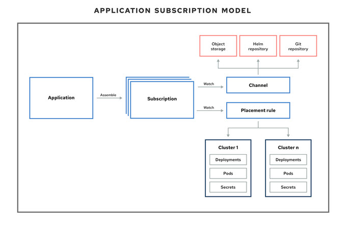

GitOps exploration
=====================
GitOps is a declarative approach to **continuous delivery** that uses Git as the single source of truth for everything (infrastructure and application)


Concepts
========
RHACM can be used to automate the deployment of applications in target environments (kubernetes clusters) and keep them synchronized 

The main concepts are (CRD):

- **Cluster Hub** : the central cluster that manage all the deployments
- **managed cluster** : the clusters where the applications are deployed to

 
- **applications** : that define the groups of subscriptions that participate to each application to deploy
- **channels** : that define the git repositories
- **subscriptions** : that define the subset of manifests in a channel that defines the kubernetes objects to deploy
- **placementrules** : that define the target cluster selection rules



Architecture
============
repository architecture:
------------------------


  - rhacm-def folder contains the descriptions of the various RHACM Custom resources
  - deployables folder contains everything needed to deploy applications

Cluster Hub namespaces
----------------------
- opencluster-management: created by default for RHACM
- rhacm-channels: to be created to host the channel(s) definition
- one namespace to be created for each application definitions

Pre-req to play with this workshop
==================================
You need two clusters:
- one as the hub cluster which will host RHACM,
- the other as a managed cluster to deploy the applications

execute the following steps:
- fork and clone the current repository on your laptop
- install RHACM on the Hub Cluster : RHACM is available as an operator in the OperatorHub ;  Complete the installation by creating a multiclusterhub instance
- import the managed cluster into the Hub Cluster
- on the Hub Cluster, create a namespace to hold the channels definitions (TO BE AUTOMATED)\
`oc new-project rhacm-channels`
- on the Hub Cluster, create a secret to access to the git repository\
`oc create secret generic git-secret --from-literal=user=xxxxxxx --from-literal=accessToken=xxxxxxxx -n rhacm-channels`

Simple use cases
=====================

UC1: Add a link to the OCP Console (Config)
-------------------------------------------
TBD

UC2: Deploy a simple application (petclinic)
--------------------------------------------
- look at gitops-with-rhacm/rhacm-def/apps/apps-group1/petclinic folder\
This folder contains the RHACM definitions for the application

- look at gitops-with-rhacm/deployables/apps/apps-group1/petclinic/base\
This folder contains the definitions for a kubernetes deployment and a service (you can ignore the kustomization.yaml for the moment)

- create a namespace to host the custom resources definitions for the application
`oc new-project petclinic`
- create the RHACM Custom resources for app1 from files\
`cd gitops-with-rhacm/rhacm-def/apps/apps-group1; oc apply -f petclinic`

- watch the resources creation from the RHACM console : as the placement rule is looking for a cluster with an app and an environment labels that it can't find yet, the application is not deployed\

- label the managed cluster with `app=petclinic` and `environment=base`
- observe the deployment on the RHACM console and on the target cluster
\


- try to scale the application up and observe that RHACM synchronizes the application back to the stage defined in Git

UC3: Add a specific route for each target environment (use kustomize)
---------------------------------------------------------------
In this use case, we will deploy the same application than for use case 2, but in several environments (dev and prod) with a custom route for each of them.

To be able to deploy a unique application to several different environments without to duplicate yaml files, we will use **kustomize** which can build a set of yaml files based on a specific directory structure separating what is common from what is specific.

In our use case ( gitops-with-rhacm/deployables/apps/apps-group1/petclinic )
- the **base** folder describes everything common : the different manifests and a kustomization.yaml file that lists the ones to deploy
- the **dev** and **prod** folders define the specificities (the routes in our case) and a kustomization.yaml file describing the base location and the list of specifics

- create the RHACM Custom resources from files\
`cd gitops-with-rhacm/rhacm-def/apps/apps-group1/petclinic/; oc apply -f dev`
- change the value of the environment label for the managed cluster, using dev or prod
- observe the deployments in RHACM console and target clusters, depending of the label value
- test the routes

UC4: managing secrets (sealed secrets)
-------------------------------------
For private Git repositories, we need a secret to hold the credentials (user/accessToken). As secrets are not encrypted, it's impossible to store these secrets in a repository.

To avoid this, we can use **sealed secrets** ( https://github.com/bitnami-labs/sealed-secrets )

We will encrypt our Secret into a SealedSecret, which is safe to store - even to a public repository. The SealedSecret can be decrypted only by the controller running in the target cluster and nobody else (not even the original author) is able to obtain the original Secret from the SealedSecret.


UC5: using Tower for pre or post hooks
---------------------------------------
- install Ansible Automation Platform Resource Operator
- create a namespace to host the credentials\
`oc new-project rhacm-credentials`
- create a crendential for Tower ( https://access.redhat.com/documentation/en-us/red_hat_advanced_cluster_management_for_kubernetes/2.4/html/credentials/credentials#creating-a-credential-for-ansible )
- create a secret in the same namespace as the subscription. You can use `oc apply` with the following content:
```
apiVersion: v1 
kind: Secret 
metadata: 
  name: toweraccess 
  namespace: petclinic
type: Opaque 
stringData: 
  token: ansible-tower-api-token 
  host: https://ansible-tower-host-url 
```
- look at the posthook directory under gitops-with-rhacm/deployables/apps/apps-group1/petclinic/prod. This is the definition of the job that will be launched after the deployment of the subscription
- create the RHACM Custom resources for a new prod application from files\
`cd gitops-with-rhacm/rhacm-def/apps/apps-group1/petclinic/; oc apply -f prod`
- change the environment label value from dev to prod on managed cluster
- observe the ansible job on the topology view
- you can also check that an ansible job has been created in petclinic namespace
- you can then see the job execution log in tower

UC6: Deploy CP4I
---------------------------------------
- create the channel\
`oc apply -k  rhacm-def/apps/CP4I`
- create the RHACM custo resources for operators\
`oc apply -k  rhacm-def/apps/CP4I/operators`
- create the RHACM custo resources for operators\
`oc apply -k  rhacm-def/apps/CP4I/instances`


