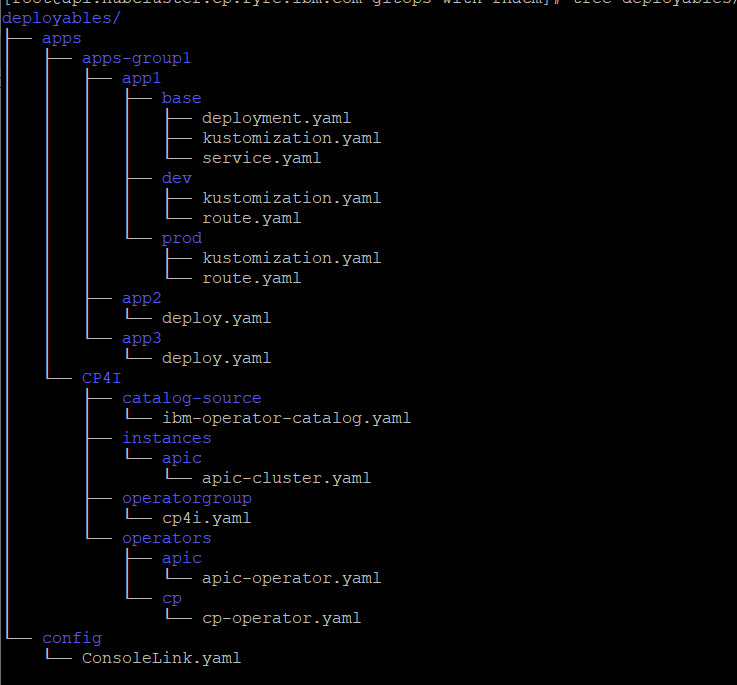

GitOps exploration
=====================
GitOps is a declarative approach to **continuous delivery** that uses Git as the single source of truth for everything (infrastructure and application)

Concepts & Architecture
=====================
RHACM can be used to automate the deployment of applications in target environments (kubernetes clusters) and keep them synchronized 

The main concepts are (CRD):

- **Cluster Hub** : the central cluster that manage all the deployments
- **managed cluster** : the clusters where the applications are deployed to

 
- **applications** : that define the groups of subscriptions that participate to each application to deploy
- **channels** : that define the git repositories
- **subscriptions** : that define the subset of manifests in a channel that defines the kubernetes objects to deploy
- **placementrules** : that define the target cluster selection rules

Installing RHACM
=====================
- RHACM is available as an operator in the OperatorHub

Simple use cases
=====================

repository architecture:
------------------------

  - rhacm-def folder contains the descriptions of the various RHACM CRD
  - deployables folder contains everything needed to deploy applications

Pre-req to play with this workshop
----------------------------------
- fork and then clone the current repository
- create a secret to access to the git repository\
`oc create secret generic git-secret --from-literal=user=xxxxxxx --from-literal=accessToken=xxxxxxxx`

UC1: Add a link to the OCP Console (Config)
-------------------------------------------
TBD

UC2: Deploy a simple application (petclinic)
--------------------------------------------
- look at gitops-with-rhacm/rhacm-def/apps/apps-group1 folder

- create the RHACM CR from files\
`cd gitops-with-rhacm/rhacm-def/apps/apps-group1; oc apply -f petclinic-channel.yaml; oc apply -f apps1`

- wait for the application to deploy and watch the resources creation from the RHACM console

- try to scale the application and observe that RHACM synchronize the application back to the stage defined in Git

UC3: Add a specific route for each target environment (use kustomize)
---------------------------------------------------------------
TBD

- the base folder describes everything common
- the dev and prod folders define the specificities

UC4: managing secrets (sealed secrets)
-------------------------------------

TBD

UC5: use Towe for non kubernetes config
---------------------------------------

security\
order dependent deployments\
objects manualy added and not described in app are not sync
